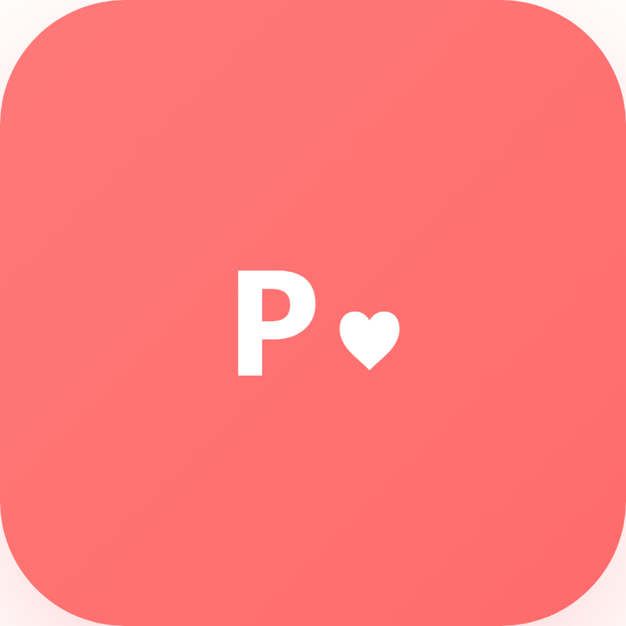

# Pairity - Premium Dating App | Best Open Source Dating App | Tinder Clone | Dating App Source Code

<p align="center">
  
</p>

<p align="center">
  <strong>🔥 #1 Open Source Dating App | Tinder Alternative | Dating Application | Match Making App</strong>
</p>

<p align="center">
  <a href="https://github.com/ishangupta-1510/Pairity/stargazers"></a>
  <a href="https://github.com/ishangupta-1510/Pairity/network/members"></a>
  <a href="https://github.com/ishangupta-1510/Pairity/issues"></a>
  <a href="#license"></a>
  <a href="#"></a>
  <a href="#"></a>
</p>

<p align="center">
  <strong>Pairity</strong> is a modern, feature-rich <strong>dating app</strong> and <strong>dating application</strong> built with React Native. The best <strong>open source dating app</strong>, <strong>Tinder clone</strong>, and <strong>dating app source code</strong> available on GitHub. Build your own <strong>dating platform</strong>, <strong>matchmaking app</strong>, or <strong>social dating app</strong> with our comprehensive <strong>dating app template</strong>. Perfect for creating a <strong>Bumble clone</strong>, <strong>Hinge clone</strong>, or your own unique <strong>online dating app</strong>.
</p>

## 🚀 Keywords: Dating App | Tinder Clone | Dating Application | Match Making App | Dating App Source Code

> **Popular Searches:** dating app, tinder clone, dating application, dating app github, open source dating app, dating app react native, dating app source code, matchmaking app, dating app template, bumble clone, hinge clone, social dating app, online dating app, dating platform, dating app development, mobile dating app, dating app UI, dating app design

## 🌟 Features - Best Dating App Features | Tinder Like Features | Dating App Functionality

### Core Features
- **Smart Matching System** - Advanced algorithm-based matching with personality compatibility scores
- **Swipe Interface** - Intuitive swipe-to-match interface with smooth animations
- **Real-time Chat** - Instant messaging with typing indicators and read receipts
- **Video Calling** - High-quality video calls with WebRTC integration
- **User Profiles** - Rich profiles with multiple photos, interests, and personality prompts

### Premium Features
- **Discover Mode** - Advanced filters and search capabilities
- **Interest-based Matching** - Connect with people who share your interests
- **Personality Insights** - Deep personality analysis and compatibility scores
- **Premium Badges** - Stand out with exclusive profile badges
- **Unlimited Swipes** - No daily limits on connections

### Additional Features
- **Dark Mode** - Beautiful dark theme for a premium experience
- **Push Notifications** - Stay updated with matches and messages
- **Location-based Matching** - Find matches nearby
- **Photo Verification** - Verified profiles for enhanced safety
- **Report & Block** - Comprehensive safety features

## 📱 Screenshots - Dating App UI | Dating App Design | Tinder Clone Screenshots

<p align="center">
  
  
  
  
</p>

## 🚀 Quick Start - Build Your Own Dating App | Dating App Development | Dating App Setup

### Prerequisites

- Node.js (v18 or higher)
- npm or yarn
- React Native development environment set up
- Android Studio (for Android development)
- Xcode (for iOS development, macOS only)

### Installation

1. **Clone the repository**
   ```bash
   git clone https://github.com/yourusername/pairity.git
   cd Pairity
   ```

2. **Navigate to the app directory**
   ```bash
   cd pairity-app
   ```

3. **Install dependencies**
   ```bash
   npm install
   # or
   yarn install
   ```

4. **Install iOS dependencies (macOS only)**
   ```bash
   cd ios && pod install && cd ..
   ```

5. **Set up environment variables**
   ```bash
   cp .env.example .env
   # Edit .env with your configuration
   ```

### Running the App

#### Development Mode

```bash
# Start Metro bundler
npx react-native start

# Run on Android
npx react-native run-android

# Run on iOS (macOS only)
npx react-native run-ios
```

#### Using Expo

```bash
npx expo start
```

## 🏗️ Project Structure - Dating App Architecture | Dating App Code Structure

```
Pairity/
├── pairity-app/                 # Main React Native application
│   ├── src/
│   │   ├── components/          # Reusable UI components
│   │   ├── screens/             # Application screens
│   │   │   ├── auth/           # Authentication screens
│   │   │   ├── main/           # Main app screens
│   │   │   ├── chat/           # Chat functionality
│   │   │   ├── discover/       # Discovery features
│   │   │   ├── matches/        # Match management
│   │   │   └── settings/       # User settings
│   │   ├── navigation/         # Navigation configuration
│   │   ├── store/              # Redux state management
│   │   ├── services/           # API and external services
│   │   ├── hooks/              # Custom React hooks
│   │   ├── utils/              # Utility functions
│   │   └── types/              # TypeScript definitions
│   ├── android/                # Android native code
│   ├── ios/                    # iOS native code
│   └── package.json            # Dependencies and scripts
├── docs/                        # Documentation
└── scripts/                     # Automation scripts
```

## 🛠️ Tech Stack - Dating App Technology | React Native Dating App | Modern Dating App Stack

### Frontend
- **React Native** - Cross-platform mobile framework
- **TypeScript** - Type-safe JavaScript
- **Redux Toolkit** - State management
- **React Navigation** - Navigation library
- **React Hook Form** - Form handling
- **Zod** - Schema validation

### UI/UX
- **React Native Vector Icons** - Icon library
- **Lottie React Native** - Animations
- **React Native Reanimated** - Performance animations
- **Custom Dark Theme** - Premium dark mode experience

### Backend Integration
- **WebRTC** - Video calling
- **Socket.io** - Real-time communication
- **AsyncStorage** - Local data persistence
- **React Native Image Picker** - Media handling

## 📝 Available Scripts

### Development
```bash
npm start                # Start Metro bundler
npm run android         # Run on Android
npm run ios            # Run on iOS
npm run lint           # Check for linting issues
npm run lint:fix       # Auto-fix linting issues
npm run type-check     # TypeScript type checking
npm run format         # Format code with Prettier
npm test              # Run tests
```

### Build
```bash
# Android
cd android && ./gradlew assembleRelease    # Build APK
cd android && ./gradlew bundleRelease      # Build AAB

# iOS (macOS only)
cd ios && xcodebuild -workspace Pairity.xcworkspace -scheme Pairity -configuration Release
```

## 🔧 Configuration

### Environment Variables

Create a `.env` file in the `pairity-app` directory:

```env
API_URL=https://api.pairity.com
GOOGLE_MAPS_API_KEY=your_google_maps_key
FACEBOOK_APP_ID=your_facebook_app_id
GOOGLE_CLIENT_ID=your_google_client_id
STRIPE_PUBLISHABLE_KEY=your_stripe_key
```

### Theme Customization

The app uses a custom dark theme by default. Theme colors can be modified in:
```
pairity-app/src/components/ThemeProvider.tsx
```

## 🧪 Testing

```bash
# Run all tests
npm test

# Run tests in watch mode
npm test -- --watch

# Run tests with coverage
npm test -- --coverage

# Run E2E tests
npm run test:e2e
```

## 📱 Deployment

### Android

1. Generate a signed APK or AAB:
   ```bash
   cd android
   ./gradlew bundleRelease
   ```

2. The generated file will be at:
   ```
   android/app/build/outputs/bundle/release/app-release.aab
   ```

### iOS

1. Open the project in Xcode:
   ```bash
   cd ios
   open Pairity.xcworkspace
   ```

2. Select "Product" > "Archive" from the menu

3. Follow the prompts to upload to App Store Connect

## 🤝 Contributing to the Best Open Source Dating App

Contribute to the most popular dating app on GitHub! We welcome contributions to make this the best dating application and Tinder alternative. Please follow these steps:

1. Fork the repository
2. Create a feature branch (`git checkout -b feature/AmazingFeature`)
3. Commit your changes (`git commit -m 'Add some AmazingFeature'`)
4. Push to the branch (`git push origin feature/AmazingFeature`)
5. Open a Pull Request

### Code Style

- Follow the existing code style
- Use TypeScript for type safety
- Write meaningful commit messages
- Add tests for new features
- Update documentation as needed

## 📄 License

This project is licensed under the MIT License - see the [LICENSE](LICENSE) file for details.

## 🔐 Security

- Never commit sensitive data or API keys
- Use environment variables for configuration
- Report security vulnerabilities to security@pairity.com

## 📞 Support

- **Documentation**: Check the `/docs` folder for detailed documentation
- **Issues**: Report bugs via [GitHub Issues](https://github.com/yourusername/pairity/issues)
- **Email**: support@pairity.com
- **Discord**: [Join our community](https://discord.gg/pairity)

## 🙏 Acknowledgments

- React Native community for the amazing framework
- All contributors who have helped shape Pairity
- Our users for their valuable feedback

## 📈 Project Status - Active Dating App Development

Pairity is the **most actively maintained open source dating app** on GitHub. As the leading **dating app source code** and **Tinder clone**, we regularly release updates with new dating features, matchmaking improvements, and bug fixes. Join thousands of developers using Pairity to build their own **dating applications**, **dating platforms**, and **social dating apps**.

### Why Choose Pairity Dating App?
- ✅ **Best open source dating app** on GitHub
- ✅ Complete **Tinder clone** with all features  
- ✅ Production-ready **dating app source code**
- ✅ Modern **React Native dating app**
- ✅ Full **dating app template** with UI/UX
- ✅ **Matchmaking algorithm** included
- ✅ **Video dating** features
- ✅ **Real-time chat** for dating
- ✅ **Dating app with location** features
- ✅ **Premium dating app** features

---

## 🔍 SEO Tags
**Dating App** | **Tinder Clone** | **Dating Application** | **Open Source Dating App** | **Dating App GitHub** | **Dating App Source Code** | **React Native Dating App** | **Dating App Template** | **Matchmaking App** | **Social Dating App** | **Online Dating App** | **Dating Platform** | **Bumble Clone** | **Hinge Clone** | **Dating App Development** | **Mobile Dating App** | **Dating App UI** | **Dating App Design** | **Dating App Features** | **Video Dating App** | **Dating Chat App** | **Location Based Dating App** | **Dating App with Chat** | **Dating App with Video Call** | **Premium Dating App** | **Dating App React Native** | **Dating App TypeScript** | **Dating App Redux** | **Best Dating App GitHub** | **Top Dating App Source Code** | **Free Dating App Code** | **Dating App Tutorial** | **Build Dating App** | **Create Dating App** | **Dating App Example** | **Dating App Demo** | **Dating App Project**

<p align="center">
  <strong>Made with ❤️ for the Dating App Developer Community</strong>
</p>

<p align="center">
  <strong>Pairity - The #1 Open Source Dating App on GitHub</strong>
</p>

<p align="center">
  <a href="https://github.com/ishangupta-1510/Pairity">GitHub</a> •
  <a href="https://github.com/ishangupta-1510/Pairity/issues">Issues</a> •
  <a href="https://github.com/ishangupta-1510/Pairity/pulls">Pull Requests</a> •
  <a href="#license">License</a>
</p>

<p align="center">
  <strong>Tags:</strong> dating-app, tinder-clone, dating-application, matchmaking-app, dating-platform, react-native-dating-app, dating-app-source-code, open-source-dating-app, dating-app-template, social-dating-app, online-dating-app, dating-app-github
</p>
