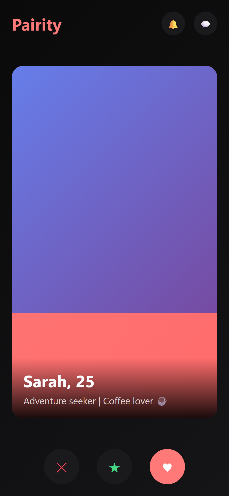
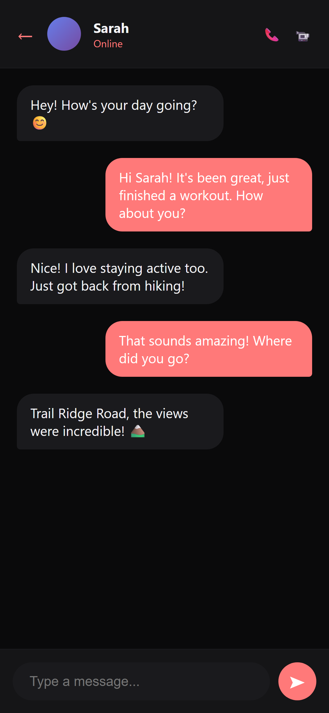
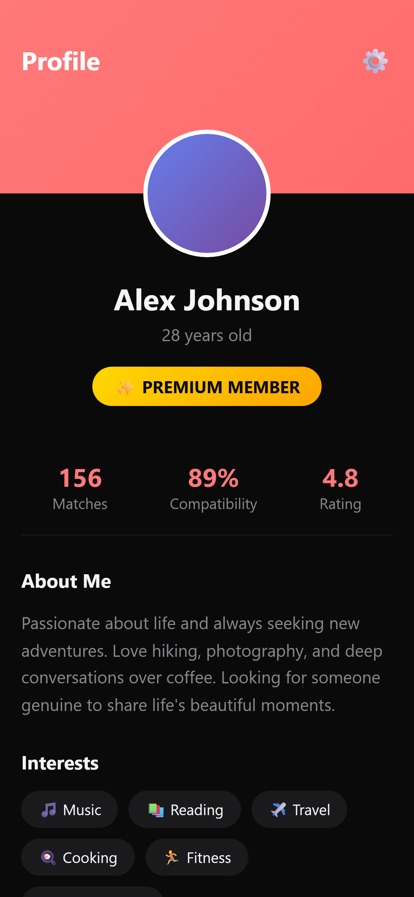
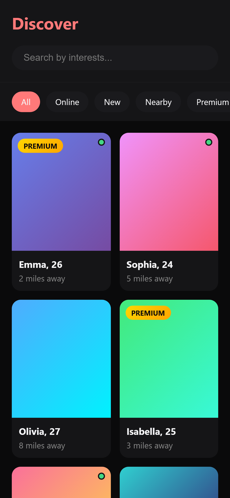

# Pairity - Premium Dating App

<p align="center">
  
</p>

<p align="center">
  <strong>Connect. Match. Find Your Pair.</strong>
</p>

<p align="center">
  A modern, feature-rich dating application built with React Native, offering a premium user experience with advanced matching algorithms, real-time chat, and video calling capabilities.
</p>

## 🌟 Features

### Core Features
- **Smart Matching System** - Advanced algorithm-based matching with personality compatibility scores
- **Swipe Interface** - Intuitive swipe-to-match interface with smooth animations
- **Real-time Chat** - Instant messaging with typing indicators and read receipts
- **Video Calling** - High-quality video calls with WebRTC integration
- **User Profiles** - Rich profiles with multiple photos, interests, and personality prompts

### Premium Features
- **Discover Mode** - Advanced filters and search capabilities
- **Interest-based Matching** - Connect with people who share your interests
- **Personality Insights** - Deep personality analysis and compatibility scores
- **Premium Badges** - Stand out with exclusive profile badges
- **Unlimited Swipes** - No daily limits on connections

### Additional Features
- **Dark Mode** - Beautiful dark theme for a premium experience
- **Push Notifications** - Stay updated with matches and messages
- **Location-based Matching** - Find matches nearby
- **Photo Verification** - Verified profiles for enhanced safety
- **Report & Block** - Comprehensive safety features

## 📱 Screenshots

<p align="center">
  
  
  
  
</p>

## 🚀 Quick Start

### Prerequisites

- Node.js (v18 or higher)
- npm or yarn
- React Native development environment set up
- Android Studio (for Android development)
- Xcode (for iOS development, macOS only)

### Installation

1. **Clone the repository**
   ```bash
   git clone https://github.com/yourusername/pairity.git
   cd Pairity
   ```

2. **Navigate to the app directory**
   ```bash
   cd pairity-app
   ```

3. **Install dependencies**
   ```bash
   npm install
   # or
   yarn install
   ```

4. **Install iOS dependencies (macOS only)**
   ```bash
   cd ios && pod install && cd ..
   ```

5. **Set up environment variables**
   ```bash
   cp .env.example .env
   # Edit .env with your configuration
   ```

### Running the App

#### Development Mode

```bash
# Start Metro bundler
npx react-native start

# Run on Android
npx react-native run-android

# Run on iOS (macOS only)
npx react-native run-ios
```

#### Using Expo

```bash
npx expo start
```

## 🏗️ Project Structure

```
Pairity/
├── pairity-app/                 # Main React Native application
│   ├── src/
│   │   ├── components/          # Reusable UI components
│   │   ├── screens/             # Application screens
│   │   │   ├── auth/           # Authentication screens
│   │   │   ├── main/           # Main app screens
│   │   │   ├── chat/           # Chat functionality
│   │   │   ├── discover/       # Discovery features
│   │   │   ├── matches/        # Match management
│   │   │   └── settings/       # User settings
│   │   ├── navigation/         # Navigation configuration
│   │   ├── store/              # Redux state management
│   │   ├── services/           # API and external services
│   │   ├── hooks/              # Custom React hooks
│   │   ├── utils/              # Utility functions
│   │   └── types/              # TypeScript definitions
│   ├── android/                # Android native code
│   ├── ios/                    # iOS native code
│   └── package.json            # Dependencies and scripts
├── docs/                        # Documentation
└── scripts/                     # Automation scripts
```

## 🛠️ Tech Stack

### Frontend
- **React Native** - Cross-platform mobile framework
- **TypeScript** - Type-safe JavaScript
- **Redux Toolkit** - State management
- **React Navigation** - Navigation library
- **React Hook Form** - Form handling
- **Zod** - Schema validation

### UI/UX
- **React Native Vector Icons** - Icon library
- **Lottie React Native** - Animations
- **React Native Reanimated** - Performance animations
- **Custom Dark Theme** - Premium dark mode experience

### Backend Integration
- **WebRTC** - Video calling
- **Socket.io** - Real-time communication
- **AsyncStorage** - Local data persistence
- **React Native Image Picker** - Media handling

## 📝 Available Scripts

### Development
```bash
npm start                # Start Metro bundler
npm run android         # Run on Android
npm run ios            # Run on iOS
npm run lint           # Check for linting issues
npm run lint:fix       # Auto-fix linting issues
npm run type-check     # TypeScript type checking
npm run format         # Format code with Prettier
npm test              # Run tests
```

### Build
```bash
# Android
cd android && ./gradlew assembleRelease    # Build APK
cd android && ./gradlew bundleRelease      # Build AAB

# iOS (macOS only)
cd ios && xcodebuild -workspace Pairity.xcworkspace -scheme Pairity -configuration Release
```

## 🔧 Configuration

### Environment Variables

Create a `.env` file in the `pairity-app` directory:

```env
API_URL=https://api.pairity.com
GOOGLE_MAPS_API_KEY=your_google_maps_key
FACEBOOK_APP_ID=your_facebook_app_id
GOOGLE_CLIENT_ID=your_google_client_id
STRIPE_PUBLISHABLE_KEY=your_stripe_key
```

### Theme Customization

The app uses a custom dark theme by default. Theme colors can be modified in:
```
pairity-app/src/components/ThemeProvider.tsx
```

## 🧪 Testing

```bash
# Run all tests
npm test

# Run tests in watch mode
npm test -- --watch

# Run tests with coverage
npm test -- --coverage

# Run E2E tests
npm run test:e2e
```

## 📱 Deployment

### Android

1. Generate a signed APK or AAB:
   ```bash
   cd android
   ./gradlew bundleRelease
   ```

2. The generated file will be at:
   ```
   android/app/build/outputs/bundle/release/app-release.aab
   ```

### iOS

1. Open the project in Xcode:
   ```bash
   cd ios
   open Pairity.xcworkspace
   ```

2. Select "Product" > "Archive" from the menu

3. Follow the prompts to upload to App Store Connect

## 🤝 Contributing

We welcome contributions! Please follow these steps:

1. Fork the repository
2. Create a feature branch (`git checkout -b feature/AmazingFeature`)
3. Commit your changes (`git commit -m 'Add some AmazingFeature'`)
4. Push to the branch (`git push origin feature/AmazingFeature`)
5. Open a Pull Request

### Code Style

- Follow the existing code style
- Use TypeScript for type safety
- Write meaningful commit messages
- Add tests for new features
- Update documentation as needed

## 📄 License

This project is licensed under the MIT License - see the [LICENSE](LICENSE) file for details.

## 🔐 Security

- Never commit sensitive data or API keys
- Use environment variables for configuration
- Report security vulnerabilities to security@pairity.com

## 📞 Support

- **Documentation**: Check the `/docs` folder for detailed documentation
- **Issues**: Report bugs via [GitHub Issues](https://github.com/yourusername/pairity/issues)
- **Email**: support@pairity.com
- **Discord**: [Join our community](https://discord.gg/pairity)

## 🙏 Acknowledgments

- React Native community for the amazing framework
- All contributors who have helped shape Pairity
- Our users for their valuable feedback

## 📈 Project Status

This project is actively maintained and in continuous development. We regularly release updates with new features, improvements, and bug fixes.

---

<p align="center">
  Made with ❤️ by the Pairity Team
</p>

<p align="center">
  <a href="https://pairity.com">Website</a> •
  <a href="https://twitter.com/pairityapp">Twitter</a> •
  <a href="https://instagram.com/pairityapp">Instagram</a>
</p>
